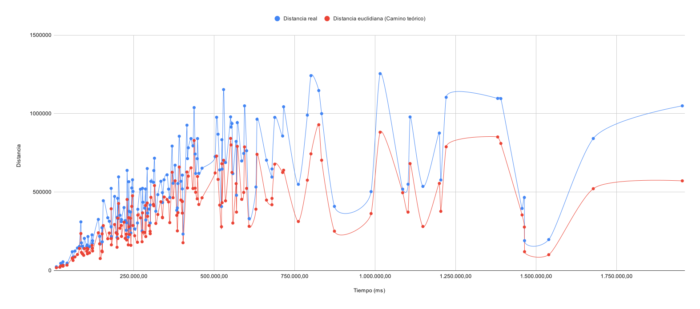
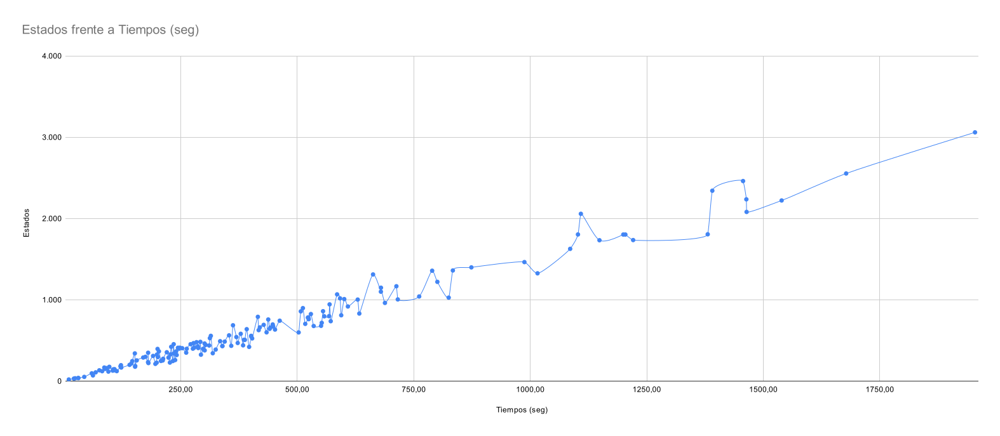

# UBAE - Comparación A* y algoritmo genético

## Tabla de contenido
- [Introducción](#introducción)
- [Marco teórico](#marco-teórico)
   - [Algoritmo A*](#algoritmo-a)
- [Diseño Experimental](#diseño-experimental)
   - [Métricas](#métricas)
   - [Herramientas Utilizadas](#herramientas-utilizadas)
   - [Proceso de Testing](#proceso-de-testing)
      - [Modelado](#modelado)
      - [Manipulación de Datos](#manipulación-de-datos)
      - [Testing](#testing)
   - [Resultados algoritmo A*](#resultados-algoritmo-a)
   - [Resultados algoritmo genético](#resultados-algoritmo-genético)
- [Análisis y discusión de los resultados](#análisis-y-discusión-de-los-resultados)
- [Conclusiones finales](#conclusiones-finales)
- [Bibliografía](#bibliografía)
- [Integrantes](#integrantes)

# Introducción

En la vida cotidiana el ser humano debe viajar de un lugar a otro prácticamente todos los días, ya sea al lugar de trabajo, donde estudia, de visita a un familiar/amigo o por alguna consulta a su doctor de preferencia entre innumerables motivos.

Muchas veces se da el caso que debe salir de urgencia y necesita un transporte que le brinde la comodidad de retirarlo en el lugar donde se encuentra y trasladarlo al destino en el menor tiempo posible. Aunque existen muchos proveedores de este servicio, suelen verse afectado por diferentes factores de la realidad como puede ser el tráfico, la ubicación del conductor, la distancia que se debe recorrer, por no mencionar la más discutible y estudiada, encontrar el camino óptimo entre el origen y destino.

A partir de esta problemática, hemos decidido crear el proyecto **UBAE** el cual está pensado para utilizar diferentes técnicas inteligentes proporcionadas por la cátedra **Inteligencia Artificial de la Universidad Nacional de Cuyo (UNCuyo)**.

Este proyecto se centra en simular la lógica interna del aplicativo UBER aplicando los algoritmos A* y Genético sobre datos reales para luego comparar sus resultados y poder decidir en qué caso aplicar uno u otro dependiendo del contexto en el que nos encontremos.

Hemos elegido este contexto ya que, si bien existen muchos algoritmos que encuentran un camino óptimo (Dijkstra, Prim, BFS, etc.) no poseen un bajo costo de ejecución al momento de aplicarlos en conjuntos grandes de datos. Además, darle _"inteligencia"_ a los algoritmos para que no sea solo una automatización sino que lleguen a _"pensar y deducir"_ hacia donde se encuentra el mejor camino y así decidir la solución es algo que beneficia en gran medida el problema planteado.

# Marco teórico

Para abordar la solución al problema planteado, se han seleccionado dos algoritmos vistos durante el cursado: A* y Genético. Cada uno de estos algoritmos pertenece a diferentes grupos de búsqueda y ofrecen enfoques distintos para resolver el desafío planteado.

El algoritmo A* es una forma de búsqueda informada que utiliza una heurística adicional para realizar cálculos relevantes durante el proceso de búsqueda. Esta heurística es una estimación de la distancia o costo necesario para llegar desde el estado actual al objetivo deseado. Al emplear la información proporcionada por la heurística, A* puede guiar la búsqueda de manera más eficiente, explorando primero las opciones más prometedoras y reduciendo el número total de estados evaluados.

En contraste, el algoritmo Genético se basa en un enfoque de búsqueda local. En este caso, los datos de entrada y el estado objetivo se transmiten al inicio de la ejecución, y utiliza técnicas específicas para iterativamente actualizar su estado local hasta alcanzar el objetivo. La búsqueda local del algoritmo genético se enfoca en explorar y mejorar soluciones dentro de una vecindad cercana en el espacio de búsqueda, buscando alcanzar un estado óptimo o cercano a él.

La principal diferencia entre ambos tipos de búsqueda radica en el enfoque y la información utilizada durante el proceso. La búsqueda informada, como A*, utiliza una heurística para dirigir la exploración hacia soluciones prometedoras, mientras que la búsqueda local, como el algoritmo genético, se concentra en explorar el entorno cercano y mejorar gradualmente la solución sin utilizar una heurística.

## Algoritmo A*

El objetivo principal del algoritmo A* es minimizar la cantidad de estados recorridos, en el caso de este proyecto se utiliza su inteligencia para encontrar la ruta ótima de un nodo a otro. A* utiliza una función de evaluación que combina dos componentes clave:

1. **Función de costo acumulado (g):** Representa el costo real acumulado para llegar desde el nodo inicial al nodo actual a lo largo del camino.

2. **Función heurística (h):** Es una estimación del costo para ir desde el nodo actual al objetivo. Esta función debe ser admisible, lo que significa que nunca debe sobreestimar el costo real de llegar al objetivo.

El funcionamiento del algoritmo A* es el siguiente:

1. **Inicialización:** Se establece un nodo inicial y se le asigna un valor de costo cero. También se crea una estructura de datos, como una lista de prioridad en nuestro caso, para mantener los nodos pendientes de exploración.

2. **Bucle principal:** Mientras haya nodos en la lista de prioridad, el algoritmo sigue el siguiente procedimiento:

   a. Se selecciona el nodo con el menor valor de f(n) = g(n) + h(n) de la lista de prioridad. Este nodo es el candidato para ser explorado a continuación.

   b. Si el nodo seleccionado es el nodo objetivo, hemos encontrado la solución óptima y podemos reconstruir el camino de vuelta siguiendo los enlaces de los padres desde el nodo objetivo al nodo inicial.

   c. Si el nodo seleccionado no es el objetivo, se generan sus adyacentes (nodos vecinos alcanzables desde él). Para cada sucesor:

      - Se calcula el costo acumulado (g) sumando el costo del nodo actual (g) con el costo de llegar al vecino desde el nodo actual.
      - Se calcula la función heurística (h) para el sucesor.
      - Se calcula f(sucesor) = g(sucesor) + h(sucesor).
      - Si el sucesor ya está en la lista de prioridad con un costo menor, se ignora el sucesor.
      - Si el sucesor no está en la lista de prioridad o tiene un costo menor, se agrega a la lista de prioridad con los valores actualizados de g y h, y se establece el nodo actual como el padre del sucesor.

3. **Terminación:** El algoritmo termina cuando no quedan más nodos en la lista de prioridad, lo que indica que no se puede encontrar una solución o se ha encontrado la ruta óptima desde el nodo inicial al nodo objetivo.

## Algoritmo genético

El algoritmo genético es una técnica de búsqueda y optimización basada en la teoría de la evolución biológica. Está diseñado para encontrar soluciones aproximadas a problemas de optimización global, especialmente en espacios de búsqueda grandes y complejos. El algoritmo genético se inspira en la evolución natural y utiliza conceptos como selección, reproducción y mutación para mejorar gradualmente una población de soluciones candidatas.

El funcionamiento del algoritmo genético es el siguiente:

1. **Inicialización:** Se crea una población inicial de soluciones candidatas de manera aleatoria. Cada solución candidata se representa como un cromosoma, que puede ser un vector de valores o una cadena de bits.

2. **Evaluación de la aptitud (función de adaptación):** Se evalúa la aptitud de cada solución candidata en la población. La función de adaptación determina qué tan buena es cada solución en términos de la calidad de la solución al problema dado.

3. **Selección:** Se seleccionan soluciones candidatas para reproducirse y formar la próxima generación. Las soluciones con una aptitud más alta son las que quedan seleccionadas.

4. **Reproducción:** Las soluciones seleccionadas se combinan para crear nuevas soluciones candidatas (descendencia). Esto se puede hacer mediante operadores genéticos como cruces (crossover) y recombinaciones, que mezclan características de los padres para formar soluciones hijas.

5. **Mutación:** Se aplican cambios aleatorios en las soluciones candidatas (mutación) para introducir nuevas características y evitar quedar atrapado en óptimos locales.

6. **Reemplazo:** La población actual se reemplaza con la nueva generación de soluciones candidatas creadas a través de la reproducción y la mutación.

7. **Terminación:** El algoritmo continúa iterando a través de las generaciones hasta que se alcanza un criterio de terminación predeterminado, como un número máximo de generaciones o cuando se logra una solución satisfactoria.

# Diseño Experimental

En esta sección del informe se presenta el diseño experimental realizado para llevar a cabo los experimentos y obtener las muestras. Se utilizaron datos reales proporcionados por el profesor de la cátedra.

## Métricas

Las métricas consideradas para evaluar los resultados son las siguientes:

1. Tiempos de ejecución.
2. Cantidad de estados recorridos.
3. Costo del camino encontrado.
4. Distancia restante para llegar al objetivo (solo aplicable al algoritmo genético).

## Herramientas Utilizadas

Dado que el caso de estudio es particular y requiere un enfoque personalizado, se desarrolló un programa propio encargado de ejecutar los algoritmos y gestionar los resultados.

## Proceso de Testing

A continuación, se describe el proceso seguido para generar el ambiente en el que ejecutaron los algoritmos.

### Modelado

En la etapa de modelado, se analizó el conjunto de datos a utilizar y se observó que la cantidad de nodos y distancias era considerable, lo que hacía inviable el formateo manual. Por lo tanto, se optó por generar un script que realizara el mapeo correspondiente del formato de origen al formato requerido por el proyecto de base de datos.

### Manipulación de Datos

Con el objetivo de optimizar el manejo de datos, se desarrolló un programa en Python que leyera los documentos mencionados anteriormente y proporcionara los datos necesarios según sea necesario.

Sin embargo, esta solución presentaba un consumo excesivo de recursos y no resultaba eficiente. Por este motivo, se decidió crear un proyecto en Node.js que generara una base de datos SQLite. Dicha base de datos fue poblada con los datos reales, y se implementaron endpoints para acceder a ellos de manera eficiente.

Posteriormente, se conectó el proyecto de base de datos con el módulo Environment.py, encargado de realizar las consultas necesarias y mapearlas a los algoritmos desarrollados en Python.

### Testing

Para finalizar, se desarrollaron varios programas en Python que llevaron a cabo la ejecución de los algoritmos. Estos programas generaron pares de nodos de prueba a partir de los nodos originales y actualizaron los archivos de monitoreo. Uno de estos programas fue diseñado para ejecutarse en caso de posibles fallos durante la ejecución del programa principal. La única función de este último programa era actualizar los archivos de pares pendientes y resueltos, basándose en el archivo de resultados.

Una vez que los programas estuvieron listos, se procedió a ejecutar los algoritmos. Se detectó cierta lentitud en la búsqueda de resultados, por lo que se implementó un programa capaz de buscar varios caminos en paralelo. Esto permitió optimizar el tiempo de búsqueda y obtener los datos necesarios para el análisis de los resultados.

## Resultados algoritmo A*

En esta sección se muestran graficos que representan resultados de la ejecución del algoritmo A*. Dichos resultados se basan en los datos de la tabla [`resultados-astar`](./public/resultados-astar.md) la cual ha sido generada a partir de las ejecuciones experimentales correspondientes.

Según los datos que se muestran en la *Figura 1* podemos deducir que, a medida que incrementa la distancia entre los nodos que se desean conectar, el tiempo de ejecución también aumenta significativamente. Además de demostrar que la distancia del camino encontrado no se encuentra muy lejos de la distancia euclidiana (distancia teórica).

   
   <em>Figura 1. Distancia real y euclidiana entre los nodos frente a tiempos de ejecución en milisegundos.</em>

 

También se evidencian algunos casos particulares en los que existe una distancia relativamente corta entre los nodos, pero aún así el algoritmo demora hasta 25 minutos (1.500.000 milisegundos) para encontrar el camino. Este se debe a que el objetivo del algoritmo A* es descubrir el camino más óptimo, incluso si eso implica revisar una mayor cantidad de nodos.

Esta relación entre cantidad de estados recorridos y el tiempo de resolución puede verse claramente en la *Figura 2*. Allí, puede verse claramente la tendencia alcista que posee dicha relación.

   
   <em>Figura 2. Cantidad de estados recorridos frente a tiempos de ejecución en segundos.</em>

## Resultados algoritmo genético

A continuación se muestran graficos que representan resultados de la ejecución del algoritmo genético. Dichos resultados se basan en los datos ingresados sobre las tablas [`resultados-agen20`](./public/resultados-agen20.md), [`resultados-agen40`](./public/resultados-agen40.md) y [`resultados-agen60`](./public/resultados-agen60.md).

Según los datos que se muestran en la *Figura 3* podemos observar la distancia a la cúal queda el algotitmo y el costo del camino generado, haya o no llegado a su solución.

   
   <em>Figura 3. Distancia real y costo del camino encontrado frente a tiempos de ejecución en segundos.</em>

 

A continuación, en la *Figura 4* se muestra la cantidad de poblaciones que se generaron a través del tiempo, en la cual se aprecia que esta aumenta irregularmente a través del tiempo.

   
    
   <em>Figura 4. Poblaciones frente a tiempos de ejecución en segundos.</em>

### Comparativas 

Se realizaron testeos y se recolectaron datos de los fitness para promediar su comportamiento con el paso de las poblaciones. En las *Figuras 5, 6 y 7* se puede apreciar como el fitness disminuye con cada población y en las poblaciones con un tope mayor de nodos la diferencia es mas grande.

   
   <em>Figura 5. Fitness promedio frente a poblaciones(máximo 20 nodos).</em>

 

   
   <em>Figura 6. Fitness promedio frente a poblaciones(máximo 40 nodos).</em>

 

   
   <em>Figura 7. Fitness promedio frente a poblaciones(máximo 60 nodos).</em>

 

Tambien se muestra una comparación con una búsqueda random del camino. Dichos datos se basan en los resultados descriptos en la tabla [`resultados-agen-random`](./public/resultados-agen-random.md). En las *Figuras 8, 9 y 10* se aprecia que la diferencia es mínima cuando los individuos están limitados a solo 20 nodos, pero a medida que aumenta el límite de nodos por individuo la diferencia incrementa.

   
   <em>Figura 8. Comparativa Algoritmo genético vs random(máximo 20 nodos).</em>

 

   
   <em>Figura 9. Comparativa Algoritmo genético vs random(máximo 40 nodos).</em>

 

   
   <em>Figura 10. Comparativa Algoritmo genético vs random(máximo 60 nodos).</em>

 

# Análisis y discusión de los resultados

Como se ha mencionado previamente, en base a los resultados obtenidos, se puede inferir que el algoritmo A* es altamente efectivo cuando se aplica en casos donde la distancia entre los nodos es corta, ya que permite encontrar el camino óptimo en cuestión de segundos. Por otro lado, el algoritmo genético muestra resultados menos satisfactorios, ya que en la mayoría de los casos solo logra obtener una aproximación de la solución final, sin alcanzar la precisión deseada.

Es importante destacar que el algoritmo genético presenta una buena aproximación en casos donde el camino es extremadamente largo en tiempos de ejecución relativamente cortos. Esta ventaja no se encuentra en el algoritmo A*, ya que encontrar el camino óptimo en tales situaciones puede llevar hasta varios días, lo cual no es recomendable para el propósito del desarrollo en este caso específico.

Otra ventaja significativa del algoritmo genético es su capacidad para finalizar la ejecución si no considera viable encontrar el camino buscado. Distinto es el caso para el algoritmo A* quien es capaz de analizar todos los nodos y concluir que no existe un camino posible.

# Conclusiones finales

Para concluir, se presentan diversas opciones a seguir en este proyecto.

La primera opción consiste en utilizar el proyecto UBAE con el algoritmo A* para ciudades pequeñas. Esto para garantizar tiempos de búsqueda reducidos y la satisfacción del usuario final.

La segunda opción sería desarrollar un programa que utilice el algoritmo genético para obtener una aproximación del camino en viajes más largos, y luego completarlo utilizando el algoritmo A* para mejorar la precisión.

La tercera opción, más teórica, implica ajustar los parámetros del algoritmo genético según el entorno para optimizar su búsqueda. Dado que este algoritmo permite cierta flexibilidad, se podrían implementar enfoques específicos. Por ejemplo, en ciudades con muchas calles e intersecciones, podríamos limitar la selección de nodos a una zona entre los nodos A y B, donde es más probable encontrar el camino.

Otro enfoque sería aplicar una parametrización especial en recorridos largos que incluyan varias ciudades. En lugar de cruzar todos los nodos del grafo, podríamos seleccionar puntos principales de cada ciudad a recorrer, como la capital.

Es importante tener en cuenta que, aunque se utilizaron datos reales de Estados Unidos, estos presentaban errores y no tenían un formato amigable, lo que dificultó su modelado. Para abordar este problema, se podría realizar un análisis más profundo de los datos del entorno y modelarlos de manera conveniente para mejorar la ejecución de los algoritmos. Por ejemplo, agrupar los datos por ubicación, seleccionar nodos relevantes para los caminos posibles, y eliminar nodos redundantes que se encuentren entre el camino de otros, ya que no aportarían información adicional y disminuiría la cantidad de nodos a analizar.

# Bibliografía

[1] *Stuart Russell & Peter Norvig (2004). Artificial intelligence: a modern approach, 2nd edition.*

[2] *Stuart Russell & Peter Norvig (2009). Artificial intelligence: a modern approach, 3rd edition.*

[3] *Material de cátedra.*

# Integrantes
- ### Serrano, Cristian
- ### Espejo, Fabricio