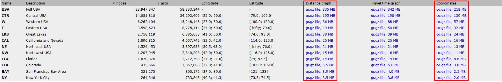

## Estructura del proyecto

- `db/`: Carpeta que contiene base de datos SQLite con los datos ya cargados.
- `resources/`: Carpeta que contiene los datos y el programa que se utiliza para minimizarlos.

## Requisitos

Versión mínima de [NodeJS](https://nodejs.org/es/download) instalada: 18.16.1

Versión mínima de [Python](https://www.python.org/downloads/) instalada: 3.11.4

## Datos

Si se desea cambiar el set de datos se deben seguir los siguientes pasos:

1) Descargar el set deseado desde [aquí](http://www.diag.uniroma1.it//challenge9/download.shtml). Los únicos archivos necesarios son los que se encuentran en la columna Distance graph y Coordinates como muestra la siguiente imagen.



2) Una vez se descarguen los archivos requeridos, se deben descomprimir y cambiar el nombre de cada uno a distancias-unparsed.txt y coordenadas.txt respectivamente.

3) Luego de poseer estos archivos, se deben insertar en la carpeta `resources/` donde se encuentran los archivos [delete.py](./resources/delete.py) y [parse.py](./resources/parse.py).

4) Con todos lo necesario porcedemos a ejecutar el script [parse.py](./resources/parse.py) el cual se encargará de realizar el mapeo correspondiente a los archivos antes descargados y renombrados.

5) Una vez ejecutado el script anterior, procedemos a ejecutar [delete.py](./resources/delete.py) el cual elimina las relaciones de distancias existentes para no repetir aristas del grafo.

6) Para finalizar podremos proceder a ejecutar el proyecto NodeJS el cual se encarga de generar y disponer la base de datos en el puerto 3000 de la máquina local.

Una vez llegado al último paso deberemos esperar un tiempo considerable para que el servidor termine de insertar los datos dentro de la base de datos. *Si se desea realizar alguna consulta para validar los datos que se han ingresado hasta el momento, podemos probarlo en [SQL Lite Online](https://sqliteonline.com/) importando la base que se genera en el directorio `db/`.*

El resultado de realizar los pasos 1) a 5) son dos ficheros (`coordenadas` y `distancias` *sin extenciones*) los cuales utiliza el proyecto para generar la base de datos a utilizar. Si se desea, se pueden eliminar los demás archivos generados.

### Formato de archivo coordenadas
```
idNodo1 coordenada_x coordenada_y
idNodo2 coordenada_x coordenada_y
idNodo3 coordenada_x coordenada_y
...
...
...
idNodon coordenada_x coordenada_y
```
### Formato de archivo distancias
```
idNodo1 idNodo2 distancia_entre_estos
idNodo2 idNodo1 distancia_entre_estos
idNodo3 idNodo4 distancia_entre_estos
...
...
...
idNodon idNodom distancia_entre_estos
```